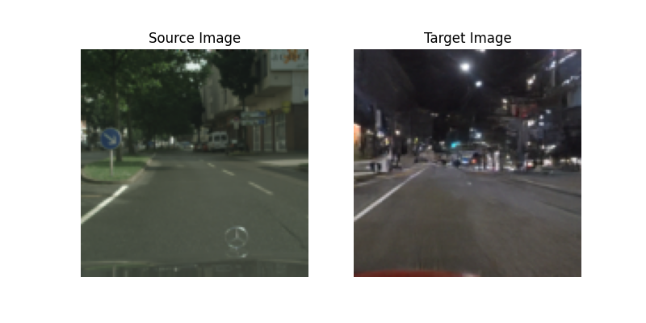
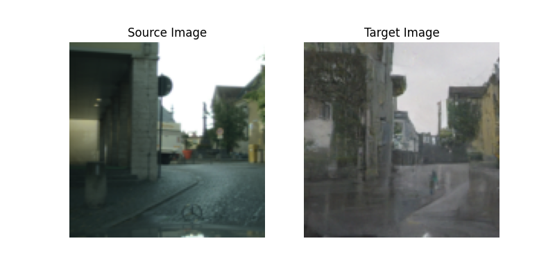
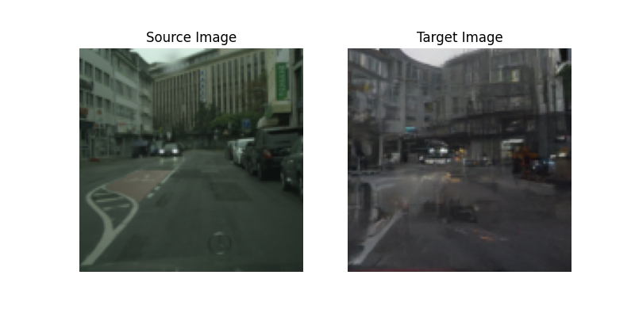

# DiffusionBasedImageTranslationWithGradientGuidance

This repository hosts an implementation of the "Diffusion-based Image Translation with Label Guidance for Domain Adaptive Semantic Segagation" paper. This project aims to translate images from a source domain to a target domain while maintaining semantic consistency between the domains.

## Paper Reference

This implementation is based on the [Diffusion-based Image Translation with Label Guidance for Domain Adaptive Semantic Segmentation](https://arxiv.org/pdf/2308.12350) paper. The segmentation model is a fine-tuned version of the [Rein repository](https://github.com/w1oves/Rein). All credits to the authors of these works.

## Installation

### Diffusion Model

To run the diffusion model, install the dependencies listed in the requirements.txt file located in the DiffusionBasedImageTranslation folder. Use the following command:

```python
pip install -r DiffusionBasedImageTranslation/requirements.txt
```
### Segmentation Model

For the segmentation model, simply follow the installation instructions provided in the original [Rein repository](https://github.com/w1oves/Rein).

## Notes

- The PTL algorithm described in the paper is yet to be implemented.
- There might be bugs present in the current implementation.

## Results





For more details, please refer to the results folder.

---

If you encounter any issues or have suggestions for improvements, feel free to open an issue or submit a pull request. Your contributions are welcome!
